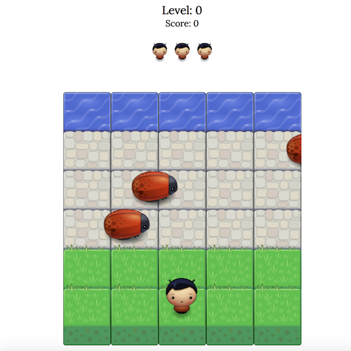

# FEND Arcade Game
A Udacity project mastering JS, HTML and CSS

## General
The goal of the game is to reach the water avoiding a collision with bugs.

Playing instructions:
Use the arrow keys to move the player on the field.

## Running instructions
1.  Download Repository
2.  Open ```index.html``` in your browser

## Screenshot


